# 천재 중학교 사회1 핵심 요약

> 중학생을 위한 핵심 개념 정리 — 다이어그램 · 표 · 예시 포함

---

## 목차

| 단원 | 제목 | 분류 |
|------|------|------|
| 0 | 지리 기초 (위치·기후·지형) | 지리 기초 |
| 1 | 아프리카 | 세계지리 |
| 2 | 아메리카 | 세계지리 |
| 3 | 오세아니아와 극지방 | 세계지리 |
| 4 | 유럽과 북부 아메리카 (+다양한 문화) | 세계지리 |
| 5 | 동아시아 (+자연재해) | 세계지리 |
| 6 | 동남·남·서아시아와 북아프리카 (+자원) | 세계지리 |
| 7 | 인간과 사회생활 | 사회 |
| 8 | 다양한 문화의 이해 | 사회 |
| 9 | 민주주의와 시민 | 사회 |
| 10 | 정치과정과 시민 참여 | 사회 |
| 11 | 일상생활과 법 | 사회 |
| 12 | 인권과 기본권 | 사회 |

---

# 🌍 세계지리 파트

---

## 단원 0 · 지리 기초

### 0-1 위치 표현과 지도
*   **위도**: 가로선, 적도(0°) 기준 남·북위 90°, **기후** 결정.
*   **경도**: 세로선, 본초 자오선 기준 동·서경 180°, **시간** 결정 (15°마다 1시간).
*   **지도**: 일반도(지형, 도로 등 종합 정보), 주제도(인구, 기후 등 특정 주제).

### 0-2 세계의 기후와 지형 기초
*   **5대 기후**: 열대(고온다우), 건조(강수 부족), 온대(사계절), 냉대(추운 겨울), 한대(혹한).
*   **주요 지형**: 
    *   **산지**: 신기 습곡 산지(험준, 화산·지진 잦음), 고기 습곡 산지(완만, 석탄 풍부).
    *   **해안**: 침식 지형(해식애, 파식대), 퇴적 지형(사빈, 갯벌).

---

## 단원 1 · 아프리카

### 1-1 아프리카의 지리적 특성

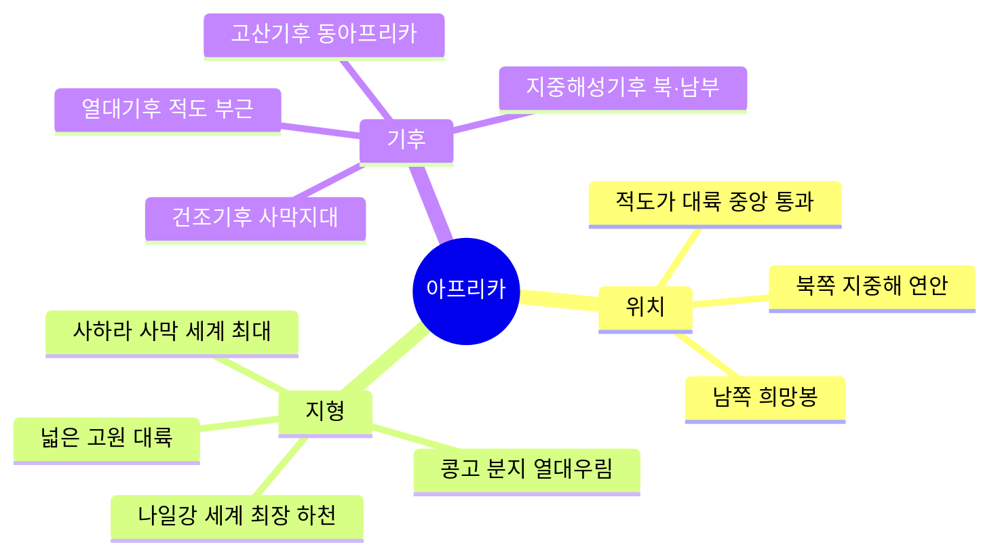

#### 주요 지형 & 기후 비교표

| 지역 | 기후 | 특징 | 대표 지역 |
|------|------|------|-----------|
| 적도 부근 | 열대우림기후 | 연중 고온다습, 밀림 | 콩고 분지 |
| 북부·남부 | 사바나기후 | 건기·우기 뚜렷 | 사헬 지대 |
| 사하라·칼라하리 | 사막기후 | 강수량 극히 적음 | 사하라 사막 |
| 지중해 연안 | 지중해성기후 | 여름 건조·겨울 습윤 | 튀니지, 남아공 |
| 동아프리카 고원 | 고산기후 | 고도 높아 선선 | 에티오피아 |

---

### 1-2 아프리카의 문화와 지역 잠재력

**핵심 키워드:** 구술 문화 · 공동체 문화 · 자원 부국

#### 풍부한 천연자원

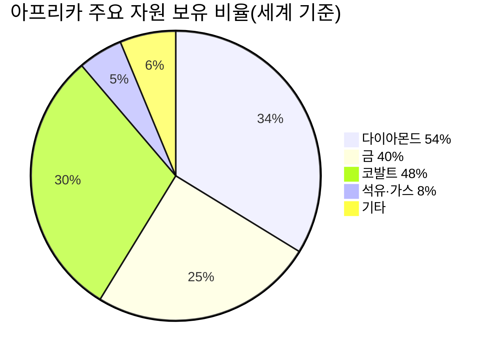

| 자원 | 주요 생산국 |
|------|-----------|
| 석유 | 나이지리아, 앙골라, 알제리 |
| 금 | 남아프리카공화국, 가나 |
| 다이아몬드 | 보츠와나, DR콩고 |
| 코발트 | DR콩고 |
| 카카오 | 코트디부아르, 가나 |

---

### 1-3 지속 가능한 발전을 위한 아프리카의 노력

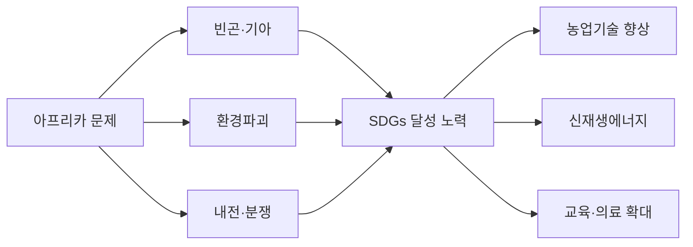

> **SDGs(지속 가능한 발전 목표):** 2030년까지 빈곤 퇴치·환경 보전·평화를 위한 17개 국제 목표

---

## 단원 2 · 아메리카

### 2-1 아메리카의 여러 국가와 자연환경

#### 아메리카 개요

| 구분 | 북아메리카 | 라틴아메리카 |
|------|-----------|------------|
| 대표 국가 | 미국, 캐나다 | 브라질, 멕시코, 아르헨티나 |
| 언어 | 영어 | 스페인어, 포르투갈어 |
| 기후 | 냉대~온대 | 열대~건조~온대 |
| 특징 | 선진국, 높은 GDP | 개발도상국 다수 |

#### 주요 자연환경

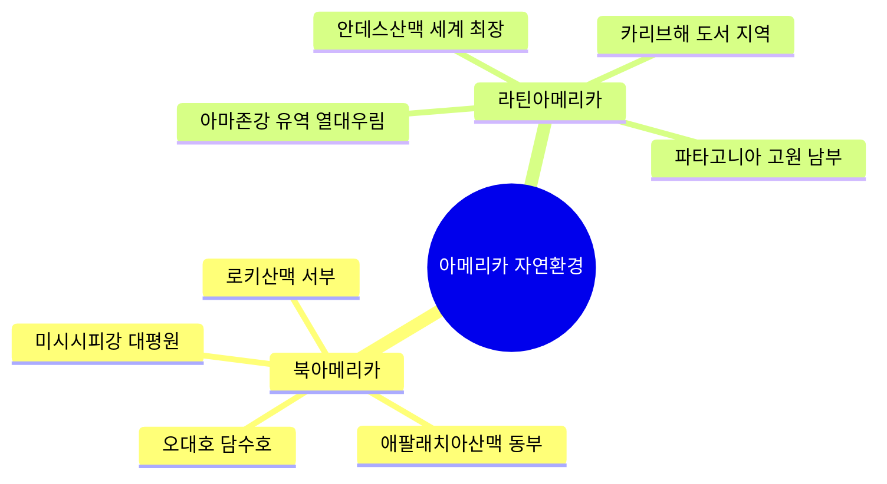

---

### 2-2 다양한 민족·민족이 어울려 사는 아메리카

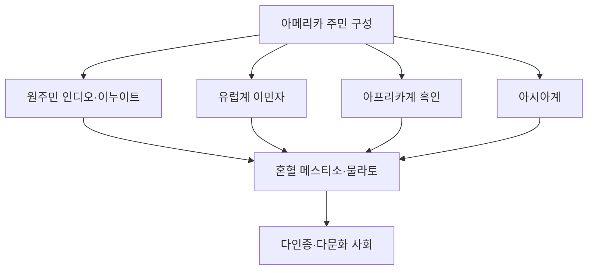

**문화 특징**

| 지역 | 음식 | 음악·축제 | 종교 |
|------|------|----------|------|
| 멕시코 | 타코, 엔칠라다 | 마리아치, 카니발 | 가톨릭 |
| 브라질 | 슈하스코, 페이조아다 | 삼바, 리우 카니발 | 가톨릭 |
| 미국 | 햄버거, 바비큐 | 재즈, 블루스 | 개신교 |
| 페루 | 세비체 | 잉카 전통 의식 | 가톨릭+토착신앙 |

---

### 2-3 초국적 기업의 분포와 지역 변화

**초국적 기업이란?** 여러 나라에 생산·판매 시설을 두고 세계적으로 활동하는 기업

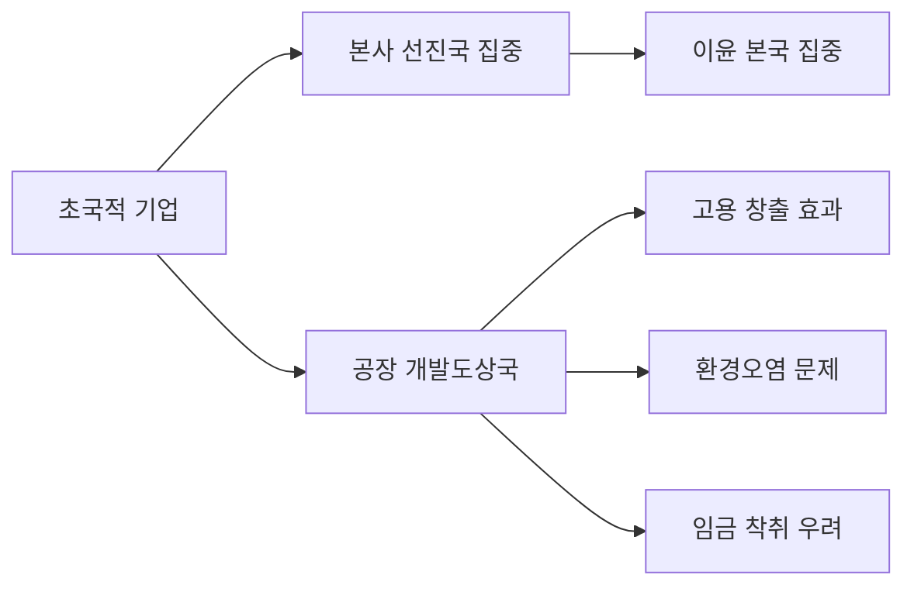

| 구분 | 긍정적 영향 | 부정적 영향 |
|------|-----------|-----------|
| 진출 지역 | 일자리 창출, 기술 이전 | 환경오염, 이윤 유출 |
| 세계 경제 | 효율적 분업, 가격 하락 | 경제 불평등 심화 |

---

## 단원 3 · 오세아니아와 극지방

### 3-1 오세아니아의 지리적 특성과 자원 수출

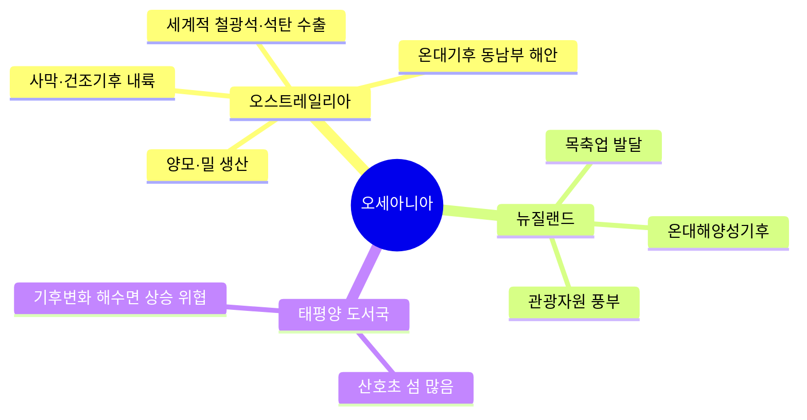

#### 오스트레일리아 주요 수출품

| 자원 | 세계 순위 | 주요 수입국 |
|------|---------|-----------|
| 철광석 | 1위 | 중국 |
| 석탄 | 상위권 | 일본, 한국 |
| 천연가스 | 상위권 | 일본, 중국 |
| 양모 | 1위 | 중국, 이탈리아 |

---

### 3-2 태평양 지역의 환경 문제와 해결 방안

**주요 환경 문제**

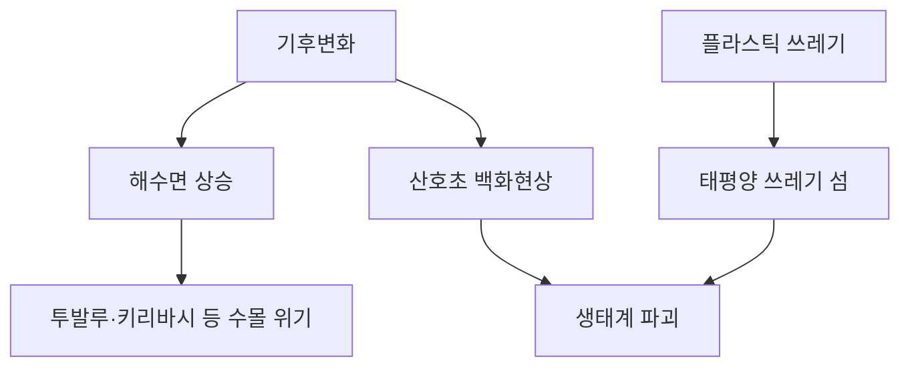

> **투발루:** 최고 높이 5m의 섬나라 — 해수면 상승으로 수십 년 내 수몰 가능성

---

### 3-3 극지방의 중요성과 지역 개발

| 구분 | 북극 | 남극 |
|------|------|------|
| 형태 | 빙하로 덮인 바다 | 대륙 위 빙하 |
| 영유권 | 주변 8개국 관할 | 남극조약으로 공동관리 |
| 자원 | 석유·천연가스 풍부 | 석탄·철광석·크릴 |
| 중요성 | 북극 항로(유럽-아시아 단축) | 과학기지 연구 |
| 우리나라 | 북극 이사회 옵서버 | 세종기지·장보고기지 |

---

## 단원 4 · 유럽과 북부 아메리카

### 4-1 유럽의 자연환경과 인문환경
**핵심 특징:** 산업 혁명의 발상지 · 선진 공업국 · 유럽 연합(EU)

*   **지형**: 북부(고기 산지 - 완만), 남부(신기 산지 - 알프스 등 험준).
*   **기후**: 서부(서안 해양성 - 연중 습윤), 남부(지중해성 - 여름 건조).
*   **농업 방식**: 
    *   혼합 농업: 가축 사육 + 식량 작물 재배 (서부/중부).
    *   수목 농업: 여름 건조에 강한 포도, 올리브 재배 (지중해).
    *   낙농업: 우유 및 유제품 생산 (북해 연안).

### 4-2 북부 아메리카와 다문화 사회
**핵심 특징:** 기업적 농업 · 첨단 산업 · 멜팅 팟(Melting Pot)

*   **농업**: **적지적작**(기계화된 대규모 농업), 밀·옥수수·목축 지대 전문화.
*   **산업**: 실리콘 밸리(첨단 IT), 항공 우주 산업 발달.
*   **문화**: 다양한 민족의 혼합. '용광로' 모델에서 '샐러드 볼' 모델(다양성 존중)로 변화.

### 4-3 [심화] 세계의 다양한 문화 지역
```mermaid
mindmap
  root((문화 지역 구분))
    동양 문화권
      유교, 불교, 벼농사, 젓가락
    이슬람 문화권
      건조 기후, 이슬람교, 아랍어
    유럽 문화권
      산업화, 기독교, 민주주의
    아메리카 문화권
      북부(영어), 라틴(스페인어)
    아프리카 문화권
      부족 중심, 구술 문화
```

---

## 단원 5 · 동아시아

### 5-1 동아시아의 기후와 생활
**핵심 키워드:** 몬순(계절풍) · 벼농사 · 문화적 공통성

*   **계절풍**: 여름(고온다우 - 벼농사 유리), 겨울(한랭건조).
*   **공통 문화**: 유교, 불교 영향, 한자 사용, 젓가락 문화.

### 5-2 [심화] 지구 곳곳의 자연재해
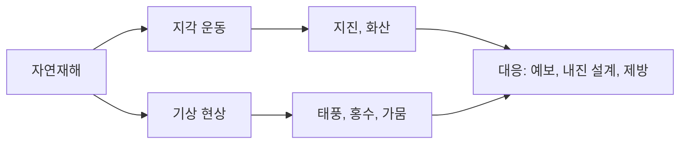
*   **환태평양 조산대**: '불의 고리'라 불리며 지진과 화산 활동이 매우 활발함.

---

## 단원 6 · 서남아시아와 북아프리카

### 6-1 건조 기후와 이슬람 문화
*   **의식주**: 흙벽집(두꺼운 벽), 온몸을 감싸는 옷, 유목 및 오아시스 농업.
*   **종교**: 이슬람교 (유일신 알라, 돼지고기 금지, 라마단 금식).

### 6-2 [심화] 자원을 둘러싼 경쟁과 갈등
**자원의 특성:** 유한성(한계), 가변성(가치 변함), 편재성(특정 지역 집중)

| 자원 | 갈등 원인 | 주요 지역 |
|------|-----------|-----------|
| **석유/가스** | 오일 머니, 에너지 패권 | 서남아시아, 카스피해 |
| **물 자원** | 댐 건설로 인한 수량 감소 | 나일강, 티그리스강 |

---

# 🏛️ 사회 파트

---

## 단원 7 · 인간과 사회생활

### 7-1 사회화와 자아 정체성

**사회화란?** 사회 구성원으로 살아가기 위한 지식·규범·가치를 배우는 과정

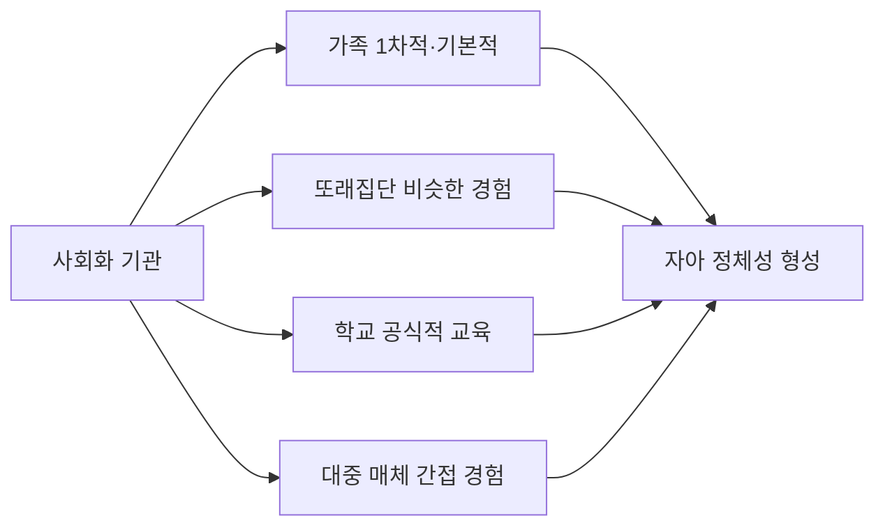

| 구분 | 1차적 사회화 기관 | 2차적 사회화 기관 |
|------|----------------|----------------|
| 예시 | 가족 | 학교, 직장, 대중매체 |
| 특징 | 친밀하고 자연스러운 관계 | 공식적이고 목적적 관계 |
| 시기 | 어린 시절 집중 | 청소년기 이후 |

> **자아 정체성:** '나는 누구인가'에 대한 스스로의 인식 — 청소년기에 특히 중요하게 형성됨

---

### 7-2 사회적 지위와 역할

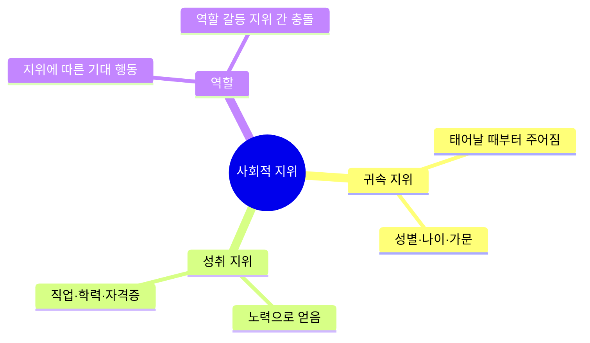

**역할 갈등 예시:**
- 학생이자 아르바이트 직원 → 시험 기간에 근무 요청
- 의사이자 부모 → 환자 치료와 자녀 학예회 겹침

---

### 7-3 사회적 갈등과 차별

| 갈등 유형 | 원인 | 해결 방법 |
|----------|------|---------|
| 계층 갈등 | 소득·자원 불평등 | 사회 안전망 강화 |
| 세대 갈등 | 가치관·경험 차이 | 세대 간 소통 강화 |
| 지역 갈등 | 개발·이익 배분 차이 | 지역 균형 발전 |
| 문화 갈등 | 다른 문화·종교 충돌 | 문화 다양성 존중 |
| 성 갈등 | 성역할 고정관념 | 성평등 의식 함양 |

**차별의 종류와 대응**

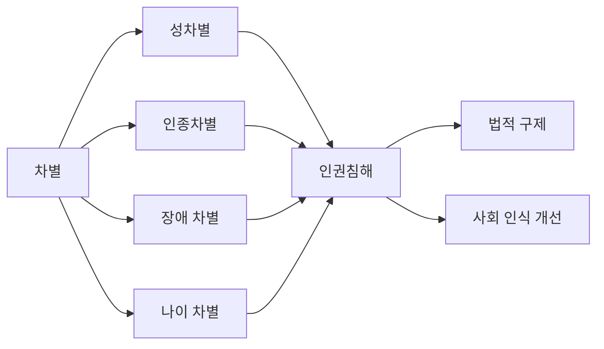

---

## 단원 8 · 다양한 문화의 이해

### 8-1 문화의 의미와 특징

**문화란?** 한 사회의 구성원들이 공유하는 생활 방식 전체

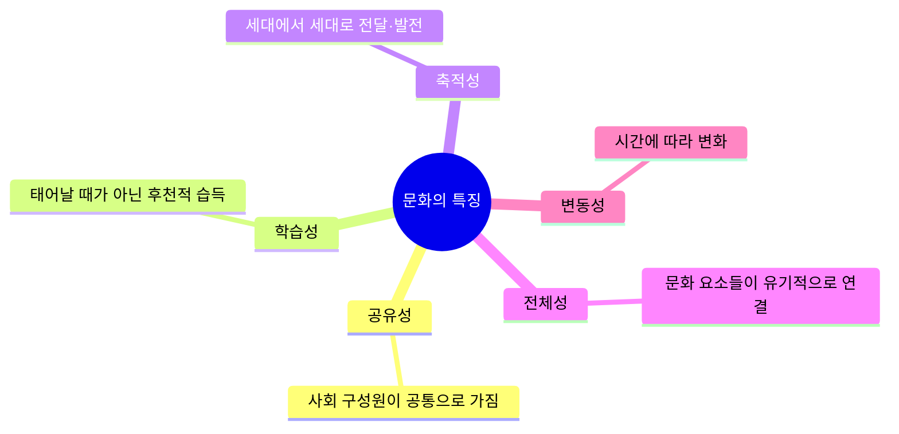

| 문화 O | 문화 X |
|--------|--------|
| 악수 인사 | 눈 깜빡임(본능) |
| 설날 세배 | 배고픔(본능) |
| 젓가락 사용법 | 재채기(반사) |

---

### 8-2 미디어를 통해 경험하는 문화

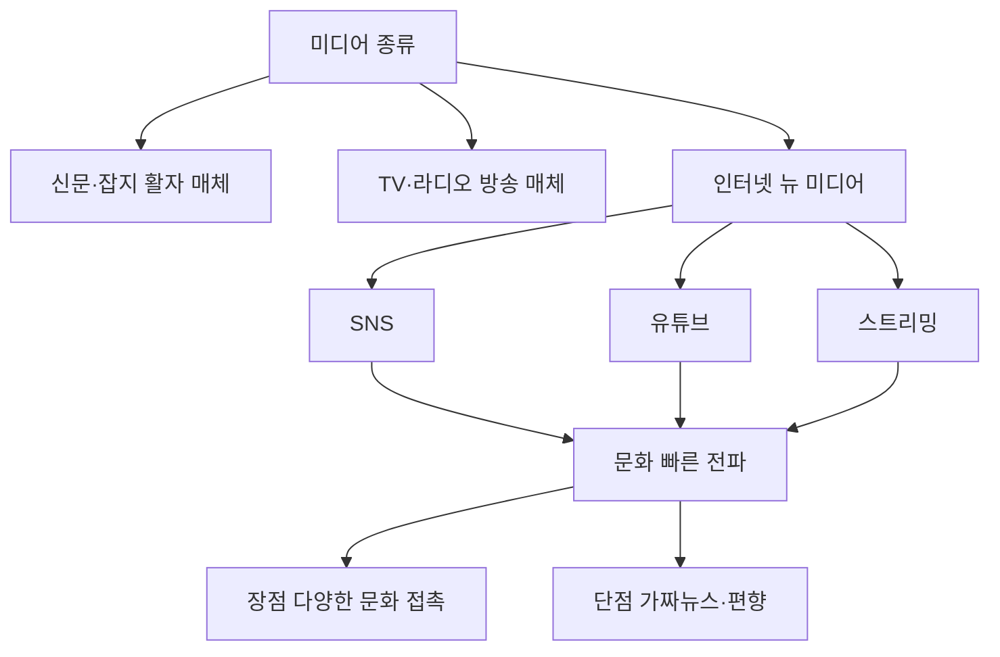

**미디어 리터러시(비판적 읽기) 3단계**
1. 정보 출처 확인하기
2. 사실 vs 의견 구분하기
3. 다양한 관점 비교하기

---

### 8-3 다양한 문화를 이해하는 태도

| 태도 | 설명 | 문제점 |
|------|------|--------|
| 자문화 중심주의 | 내 문화가 최고, 타 문화 무시 | 갈등·분쟁 유발 |
| 문화 사대주의 | 다른 문화가 더 우월하다고 맹목적 추종 | 문화 정체성 상실 |
| **문화 상대주의** | **각 문화를 그 맥락에서 이해** | **바람직한 태도** |

> **극단적 문화 상대주의 경계:** 인류 보편 가치(인권·생명)를 해치는 문화까지 인정하면 안 됨

---

## 단원 9 · 민주주의와 시민

### 9-1 정치와 민주주의

**정치란?** 사람들 사이의 갈등을 해결하고 공동체 문제를 결정하는 과정

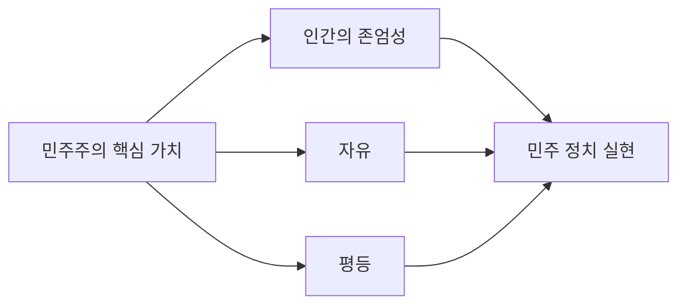

| 구분 | 직접 민주주의 | 간접 민주주의(대의제) |
|------|-------------|------------------|
| 방식 | 시민이 직접 결정 | 대표자를 선출해 결정 위임 |
| 예시 | 고대 아테네, 국민투표 | 현대 국회·의회 |
| 장점 | 민의 직접 반영 | 넓은 영토·많은 인구에 적합 |
| 단점 | 대규모 국가에 적용 어려움 | 대표자가 민의 왜곡 가능 |

---

### 9-2 민주주의의 발전 과정과 원리

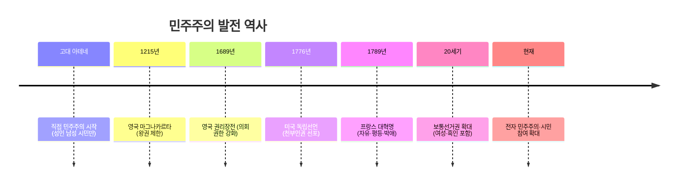

**민주주의 3대 원리**

| 원리 | 의미 | 예시 |
|------|------|------|
| 국민주권 | 권력의 원천은 국민 | 선거로 대표 선출 |
| 권력분립 | 입법·행정·사법 분리 | 삼권분립 |
| 기본권 보장 | 국민의 기본적 권리 보호 | 헌법 기본권 조항 |

---

### 9-3 현대 민주주의의 특징과 발전을 위한 노력

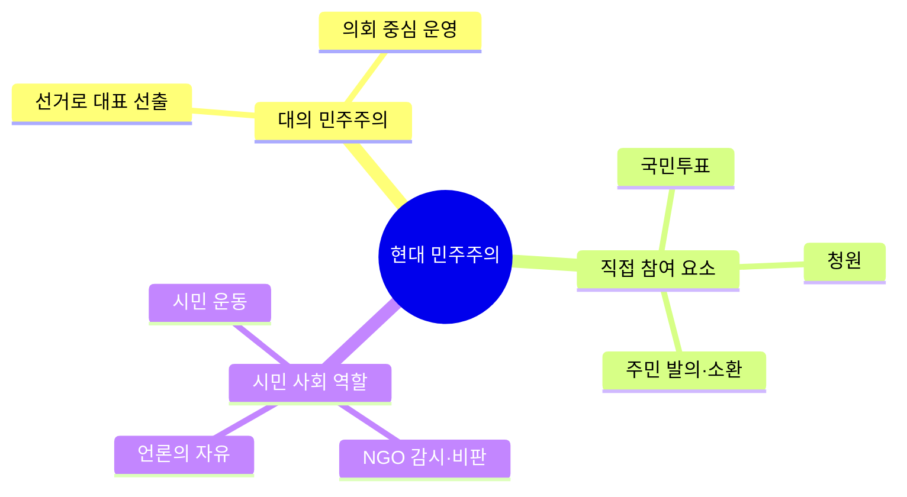

---

## 단원 10 · 정치과정과 시민 참여

### 10-1 선거의 의미와 시민의 역할

**민주 선거 4원칙**

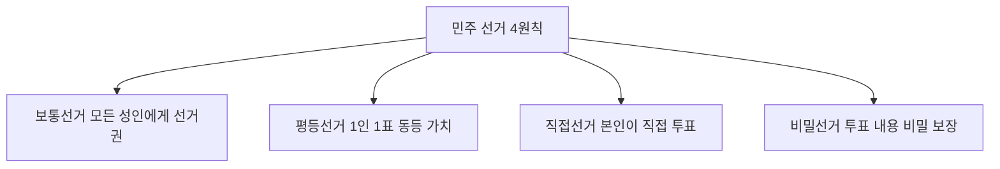

| 원칙 | 반대 개념 | 역사 |
|------|---------|------|
| 보통선거 | 제한선거 (재산·성별 제한) | 과거엔 부자·남성만 투표 |
| 평등선거 | 차등선거 | 신분에 따라 표 가중치 다름 |
| 직접선거 | 간접선거 | 미국 대통령은 선거인단 방식 |
| 비밀선거 | 공개선거 | 보복·압력 방지 |

---

### 10-2 정치 주체와 정치과정

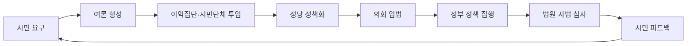

| 주체 | 역할 | 예시 |
|------|------|------|
| 정당 | 정치적 의견 조직·선거 참여 | 더불어민주당, 국민의힘 |
| 이익집단 | 특정 집단 이익 대변 | 의사협회, 노동조합 |
| 시민단체(NGO) | 공익 목적 감시·활동 | 참여연대, 환경운동연합 |
| 언론 | 정보 전달·여론 형성 | 신문, TV, 인터넷 |

---

### 10-3 지방 자치와 시민 참여

**지방 자치 = 지역 주민이 스스로 지역 문제를 해결하는 제도**

```mermaid
mindmap
  root((지방자치))
    지방의회
      조례 제정·개정
      예산 심의·의결
      행정부 감시
    지방자치단체장
      행정 집행
      예산 편성
    주민 참여 방법
      주민 투표
      주민 발의
      주민 소환
      청원
```

---

## 단원 11 · 일상생활과 법

### 11-1 법의 의미와 목적

**법이란?** 국가가 강제하는 사회 규범 — 위반 시 제재(벌금·징역 등)

```mermaid
flowchart LR
  A[사회 규범] --> B[도덕 강제X 내면의 양심]
  A --> C[관습 강제X 오래된 습관]
  A --> D[종교 강제X 신앙 기반]
  A --> E[법 강제O 국가 제재]
```

**법의 목적**
- 사회 질서 유지
- 개인의 권리 보호
- 분쟁 해결 기준 제공
- 사회 정의 실현

---

### 11-2 우리 생활과 관련된 다양한 법

| 법의 종류 | 내용 | 예시 |
|----------|------|------|
| 헌법 | 최고 법규, 기본권 보장 | 표현의 자유, 교육권 |
| 민법 | 개인 간 권리·의무 관계 | 계약, 상속, 혼인 |
| 형법 | 범죄와 형벌 규정 | 절도죄, 사기죄 |
| 상법 | 기업·상거래 관계 | 주식회사, 보험 |
| 행정법 | 국가-국민 관계 | 세금, 허가 |
| 사회법 | 약자 보호 | 노동법, 소비자보호법 |

---

### 11-3 재판의 의미와 공정한 재판의 중요성

```mermaid
flowchart TD
  A[분쟁 발생] --> B{재판 종류?}
  B --> C[민사재판 개인 vs 개인]
  B --> D[형사재판 국가 vs 피의자]
  B --> E[행정재판 국가 vs 국민]
  C --> F[판사 판결]
  D --> F
  E --> F
  F --> G[1심 지방법원]
  G --> H[2심 고등법원 항소]
  H --> I[3심 대법원 상고]
```

**3심제도의 이유:** 실수나 오판을 바로잡아 공정한 재판 보장

**공정한 재판의 요소**
- 법관의 독립 (외부 압력 배제)
- 공개 재판 (원칙적으로 공개)
- 변호인 조력권
- 무죄 추정의 원칙

---

## 단원 12 · 인권과 기본권

### 12-1 인권 보장과 헌법

**인권이란?** 태어날 때부터 누구에게나 있는 기본적 권리 — 천부인권

```mermaid
mindmap
  root((헌법상 기본권))
    자유권
      신체의 자유
      표현의 자유
      종교의 자유
    평등권
      법 앞에 평등
      차별 금지
    사회권
      교육권
      근로권
      사회보장권
    참정권
      선거권
      공무담임권
    청구권
      재판 청구권
      청원권
```

---

### 12-2 기본권 제한과 침해 시 구제 방법

**기본권 제한 요건 (헌법 37조 2항)**

```mermaid
flowchart LR
  A[기본권 제한 가능 조건] --> B[국가 안전보장]
  A --> C[질서 유지]
  A --> D[공공복리]
  B & C & D --> E[법률로만 제한 가능]
  E --> F[단, 본질적 내용은 침해 불가]
```

| 권리 침해 시 구제 방법 | 대상 | 기관 |
|---------------------|------|------|
| 헌법소원 | 공권력에 의한 기본권 침해 | 헌법재판소 |
| 행정 심판 | 행정 처분에 불복 | 각 행정기관 |
| 국가인권위원회 | 차별·인권 침해 | 국가인권위원회 |
| 국민권익위원회 | 행정 부패·불합리 | 국민권익위원회 |

---

### 12-3 근로자의 권리와 침해 시 대응 방안

**근로자 3대 권리 (노동 3권)**

```mermaid
flowchart TD
  A[노동 3권] --> B[단결권 노동조합 결성]
  A --> C[단체교섭권 사용자와 협상]
  A --> D[단체행동권 파업 등 쟁의]
```

| 근로 관련 법 | 내용 |
|-----------|------|
| 최저임금법 | 최소 임금 보장 |
| 근로기준법 | 근무시간·해고 제한 |
| 남녀고용평등법 | 성차별 금지 |
| 산업재해보상법 | 업무 중 재해 보상 |

**부당 대우 시 대응:**
1. 고용노동부에 신고
2. 노동위원회에 구제 신청
3. 법원에 소송

---

# 📝 단원별 핵심 정리 (한눈에 보기)

| 단원 | 핵심 개념 | 중요 키워드 |
|------|---------|-----------|
| 지리 기초 | 위도·경도, 기후대, 지형 형성 | 적도, 5대 기후, 습곡 산지 |
| 아프리카 | 다양한 기후대, 자원 부국, SDGs | 사하라, 나일강, 지속가능발전 |
| 아메리카 | 다인종 사회, 초국적 기업 | 안데스, 아마존, 라틴아메리카 |
| 오세아니아 | 자원 수출, 환경 위기, 극지 개발 | 철광석, 해수면 상승, 남극조약 |
| 유럽·북미 | 선진 공업, 기업적 농업, 다문화 | EU, 실리콘밸리, 샐러드 볼 |
| 동아시아 | 몬순 기후, 자연재해 대응 | 벼농사, 불의 고리, 계절풍 |
| 서남아시아 | 건조 기후, 자원 갈등, 이슬람 | 석유, 오일머니, 물 분쟁 |
| 인간과 사회 | 사회화, 지위·역할, 갈등 | 귀속지위, 성취지위, 역할 갈등 |
| 다양한 문화 | 문화 특징, 미디어, 상대주의 | 공유성, 학습성, 문화 상대주의 |
| 민주주의 | 민주주의 원리, 역사, 참여 | 국민주권, 권력분립, 대의제 |
| 정치과정 | 선거 4원칙, 정치 주체, 지방자치 | 보통·평등·직접·비밀선거 |
| 생활과 법 | 법의 종류, 재판, 3심제 | 민법·형법·헌법, 무죄 추정 |
| 인권 | 기본권 종류, 제한, 노동 3권 | 자유권·평등권·사회권, 노동조합 |

---

> **학습 TIP:** 각 단원의 "핵심 키워드"를 먼저 외우고, 다이어그램의 연결 관계를 이해하면 서술형 문제도 쉽게 답할 수 있어요!
